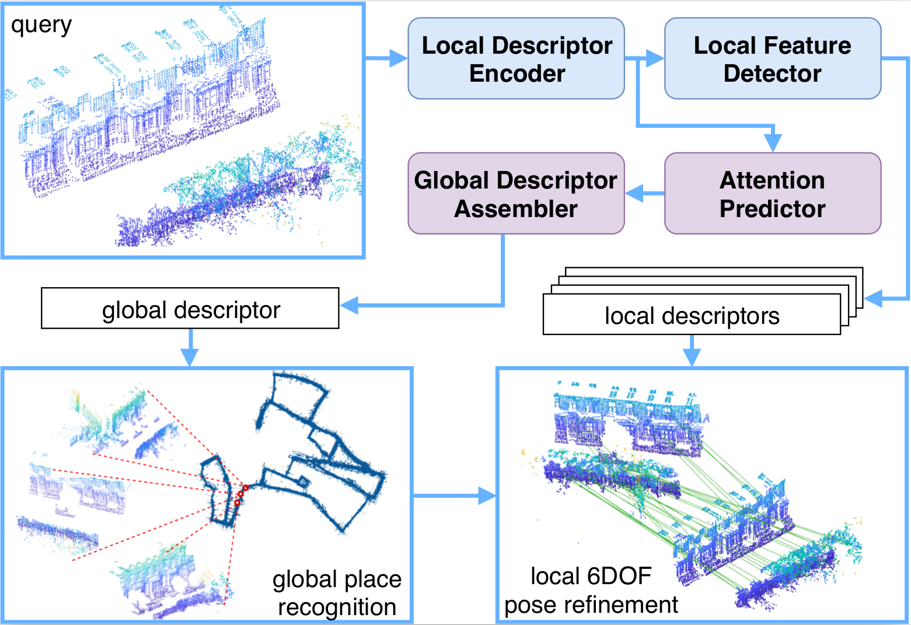
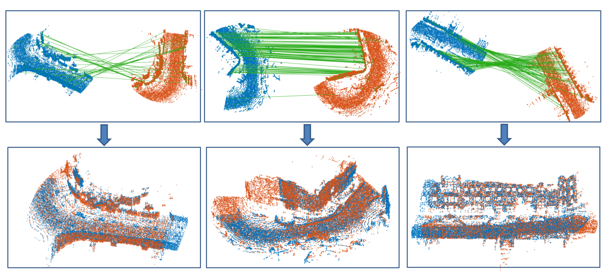
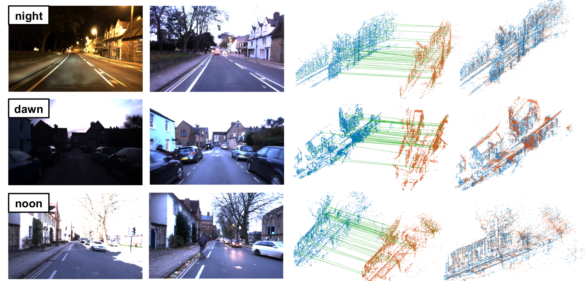
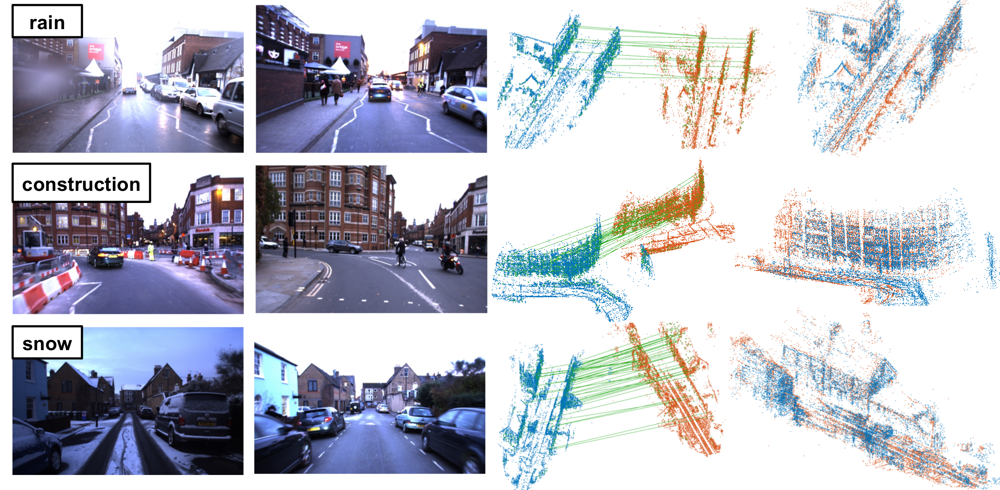

## DH3D: *Deep Hierarchical 3D Descriptors for Robust Large-Scale 6DOF Relocalization*
Created by Juan Du,
<a href="https://vision.in.tum.de/members/wangr" target="_blank">Rui Wang</a>,
<a href="https://vision.in.tum.de/members/cremers" target="_blank">Daniel Cremers</a>
at the Technical University of Munich.

**System overview:**

  

### Abstract
For relocalization in large-scale point clouds, we propose the first approach that
unifies global place recognition and local 6DoF pose refinement. To this end, we
design a Siamese network that jointly learns 3D local feature detection and description
directly from raw 3D points. It integrates FlexConv and Squeeze-and-Excitation (SE) to
assure that the learned local descriptor captures multi-level geometric information and
channel-wise relations. For detecting 3D keypoints we predict the discriminativeness of
the local descriptors in an unsupervised manner. We generate the global descriptor by
directly aggregating the learned local descriptors with an effective attention mechanism.
In this way, local and global 3D descriptors are inferred in one single forward pass.
Experiments on various benchmarks demonstrate that our method achieves competitive results
for both global point cloud retrieval and local point cloud registration in comparison to
state-of-the-art approaches. To validate the generalizability and robustness of our 3D
keypoints, we demonstrate that our method also performs favorably without fine-tuning on
the registration of point clouds that were generated by a visual SLAM system. Related
materials are provided on the project page https://vision.in.tum.de/research/vslam/dh3d.

### Citation
If you find our work useful in your research, please consider citing:

    @inproceedings{du2020dh3d,
        title={DH3D: Deep Hierarchical 3D Descriptors for Robust Large-Scale 6DoF Relocalization},
        author={Du, Juan and Wang, Rui and Cremers, Daniel},
        booktitle={European Conference on Computer Vision (ECCV)},
        year={2020}
    }

### Environment and Dependencies
We have tested with:
* Ubuntu 16.04 with CUDA 10.1 + TensorFlow 1.9
* Ubuntu 18.04 with CUDA 9.2 + TensorFlow 1.9 and TensorFlow 1.10

Other dependencies include:
* scipy
* scikit-learn
* open3d==0.9
* tabulate
* tensorpack

### Build Instructions
Create an environment:

    conda create -n dh3d python=3.6.8

Note that [Flex-Convolution](https://github.com/cgtuebingen/Flex-Convolution) (Groh et al, ACCV2018)
requires TensorFlow 1.9-1.11. In our case, we tested the TensorFlow of these versions installed
by `pip install`, but they all have problems in the following steps. We therefore recommend to build
TensorFlow from source, following [the offcial instruction](https://www.tensorflow.org/install/source).

Once TensorFlow is installed, compile the operators from [PointNet++](https://github.com/charlesq34/pointnet2)
(Qi et al, NIPS2017) in `tf_ops/`. Related information is also provided
[here](https://github.com/charlesq34/pointnet2#compile-customized-tf-operators).

    cd tf_ops/grouping/
    ./tf_grouping_compile.sh

    cd ../interpolation/
    ./tf_interpolation_compile.sh

    cd ../sampling/
    ./tf_sampling_compile.sh

Compile the operators in `user_ops/`. The `flex_conv`, `flex_pool` and `knn_bruteforece` layers are
defined by
[Flex-Convolution](https://github.com/cgtuebingen/Flex-Convolution).
We add 1x1 convolution on 3D points `conv_relative`. The detailed build instructions are provided
[here](https://github.com/cgtuebingen/Flex-Convolution). First install the header-only
[CUB primitives](https://nvlabs.github.io/cub/):

    cd /tmp
    wget https://github.com/NVlabs/cub/archive/v1.8.0.zip
    unzip v1.8.0.zip -d $HOME/libs
    export CUB_INC=$HOME/libs/cub-1.8.0/
    rm /tmp/v1.8.0.zip

Then compile the operators in `user_ops/`:

    cd user_ops/
    cmake . -DPYTHON_EXECUTABLE=python3 && make -j

### Datasets
Our model is mainly trained and tested on the LiDAR point clouds from the
<a href="https://robotcar-dataset.robots.ox.ac.uk/" target="_blank">Oxford RobotCar dataset</a>.
In addition, two extra datasets are used to test the generalizability of our model, the
<a href="https://projects.asl.ethz.ch/datasets/doku.php?id=laserregistration:laserregistration" target="_blank">ETH Laser Registration dataset</a>
and the point clouds generated by running
<a href="https://vision.in.tum.de/research/vslam/stereo-dso" target="_blank">Stereo DSO</a>
on the Oxford RobotCar sequences. The processed point clouds and corresponding ground truth files
can be downloaded under the "Datasets" session on our
<a href="https://vision.in.tum.de/research/vslam/dh3d" target="_blank">project page</a>.

Details on how these datasets are generated can be found at the beginning of Secsion 4 in the main
paper and Section 4.2 and 4.4 in the supplementary material.

### Training
To train our network, run the following command:

    # training the local descriptor part without detector for the first few epochs
    python train.py --cfg=basic_config

    # training the local descriptor and detector jointly
    python train.py --cfg=detection_config

    # training the global descriptor assembler
    python train.py --cfg=global_config

   The path to the training data should be set in the configs. For more training options please see `core/configs.py`.

### Testing
The pre-trained models for both local and global networks are saved in `models/`.

To extract the local descriptors and keypoints, run the following commands:

    cd evaluate/local_eval

    # save detected keypoints and descriptors
    python localdesc_extract.py --perform_nms

    # or save dense feature map to evaluate with other 3D detectors
    python localdesc_extract.py --save_all

Code and detailed instructions for the evaluation and visualization of the point cloud registration can be found in
`evaluate/local_eval/matlab_code/`.

To extract the global descriptors and compute the recall, run the following commands:

    cd evaluate/global_eval
    python globaldesc_extract.py --eval_recall

### Qualitative Results
* Results on LiDAR points from Oxford RobotCar:

  

* Results on point clouds generated by running
<a href="https://vision.in.tum.de/research/vslam/stereo-dso" target="_blank">Stereo DSO</a>
on Oxford RobotCar:

    
    

### License
Our code is released under the Apache License 2.0 License (see LICENSE file for details).

